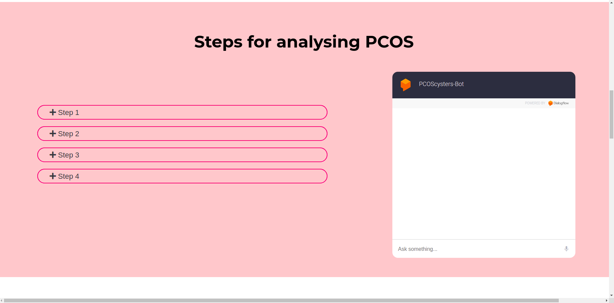

# Pratibha 💁‍♀️
Pratibha is a solution concept revolving around the women who fight one on one with various problems, one of these is Polycystic ovary syndrome (PCOS), that needs our utmost attention to raise voices.

# What is PCOS? 👩‍⚕️
**Polycystic ovary syndrome (PCOS)** is a condition that affects a woman's hormone levels, where they produce higher-than-normal amounts of male hormones. This hormone imbalance causes them to skip menstrual periods and makes it harder for them to get pregnant, higher chances to Breast Cancer, Depression, anxiety attacks and other health problems. In India nearly 20% women face PCOS, out of which nearly 1% know about PCOS. This is quite saddening and shameful to us, who have blindly folded our eyes.

# What it does 🎯
We came up with a Web Application solution named **Pratibha** especially designed to help those women who are silently bearing PCOS pain and its symptoms. The main motive of our Web Application is to spread awareness among the women in the early stage of PCOS, so that they can help themselves by referring to the best doctors available in the country or whole world and follow the best practices. The prevalence of PCOS is highly variable ranging from 2.2% to 26% globally but most women don’t even know about it. Particuarly, in India, the number of PCOS cases is about 20% which is massive. So, we have targeted to develop a HealthCare Web Application, **Pratibha** to minimize the problems due to PCOS among women & help them to live a healthy life. 

1. Since there was no effective platform where women can get acquainted with PCOS, so we introduced four basic steps to let the woman check herself if she might be suffering from PCOS.
2. This Web Application provides a Self Test Analyzer using a Machine Learning model along with other simple steps for PCOS Confirmation at home itself before reaching the doctor. 
3. In most rural places, women with no internet facilities face difficulties accessing online websites. So we have a Virtual Call Assistant who is 24X7 available to answer all the queries regarding PCOS in the native languages. 
4. To address the queries of the new-comers, we have made a ChatBot to solve basic problems regarding PCOS.
5. Every woman will have to register through a Google Account, which will be directed to a personalized dashboard where the records of prescribed medicines, problems they are facing, lab reports, details of the last meeting with the doctors. Using the appointment section, women can book appointments with the doctor online & can have meetings with the doctor via Video Calling from the dashboard. The application will directly show the medicines the woman has been taking, her reports, and the problems she is facing. 
6. The doctors also have to register through Google Account. The doctors can enter his qualification details, hospital, working hours. The doctor’s dashboard contains the list of all the patients where they can prescribe them the medicines, and keep a record of their patient's health checkup timely. 
7. The app also contains a Community Building forum for connecting to other women and doctors in different parts of the World so that they can share their problems and help each other with the best exercises and eating habits. 
8. A separate Food & Yoga is present to follow the healthy habits for curing PCOS. Since there is no complete cure and medicine for PCOS, so Food and Yoga are something that will help PCOS women.
9. This web application will have an online video calling feature so that doctors and women can connect to each other allowing better communication. 
10.Our future development includes the payment gateway integration so that patients can pay the fees of the doctors.

So the question comes: How will women check the doctor's qualification? We will be making a green tick symbol on a doctor's profile depicting the doctor’s qualification and profile is checked by the authority team of application. So that our PCOS registered women get the best possible doctors.

So the app spreads awareness, improves health standards, promotes diversity & increases the self-esteem of the women who can feel much happier and independent with such an interactive portal. 
Pratibha raises the concern for not just the women, but also for our sisters, wives, mothers, and every girl who is unaware of PCOS and suffers the pain all alone devastating their personal life. It encourages women to hold their thoughts and live a life free of pain. Every woman can access the simple, user-friendly Application remotely. 

# Technologies, Tools & Platforms used :
- HTML
- CSS
- Google DialogFlow (for chatbot)
- Google Auth 2.0
- Bootstrap
- Javascript
- JQuery
- Node.js
- Express.js
- MongoDB
- Mongoose
- MongoDB Atlas
- Machine Learning
- Python
- Flask
- Heroku

# A sneek peek into what we have :
- ### Login page:

 

- ### About Section:

 

- ### Chatbot:

 

- ### Predict Section:

 

- ### ML Model:

 

- ### Patient Dasboard:

 

 

 

- ### Doctor Dashboard:

 

 

- ### Features Section:

 

- ### Doctors Community: 

 

- ### Yoga & Food:

 

- ### Community Blogs:

 

# What's next for Pratibha Web Application ?✨
1. MultiLingual platform & calling feature for native women.
2. Self Test integrated Call Agent using ML model.
3. Daily streak for yoga & exercises.
4. Weekly Health Analysis of Patients.
5. Payment Integration.
6. Online Video meetings.
7. Push notification for daily updates.

### <i>Hope you like it ❤️.
